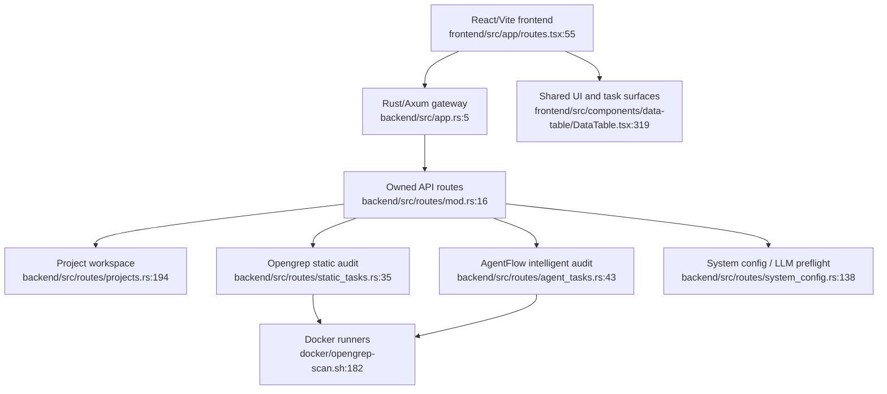

# PATHFINDER 2026-04-30 — Feature Inventory

## Feature discovery status

The mandated Feature Discovery subagent was launched, but the provider returned `502 Bad Gateway`. I continued locally with read-only source inspection and kept the same citation contract. This inventory is based on top-level docs plus concrete entry points in backend/frontend/docker code.

## Sources consulted

- `README.md:7-30` — startup and current Rust backend + TypeScript frontend runtime notes.
- `README_EN.md:21-35` — `.argus-intelligent-audit.env` and repo-local Codex/OMX notes.
- `docs/architecture.md:18-55` — current system mainline and audit mode boundaries.
- `docs/architecture.md:96-124` — request-flow summary for project creation, static audit, intelligent audit, and LLM preflight.
- `docs/glossary.md:11-27` — `Project`, static audit, intelligent audit definitions.
- `docs/glossary.md:66-76` — agent preflight and LLM config set definitions.
- `backend/src/app.rs:5-14`, `backend/src/routes/mod.rs:16-30` — Rust gateway router ownership.
- `frontend/src/app/routes.tsx:55-170` — primary frontend route map.

## Current system overview

## Feature boundaries

### 1. Rust Gateway Shell

- **Purpose**: Owns HTTP routing, state injection, and fallback behavior for all current API surfaces.
- **Entry points**: `backend/src/main.rs:8`, `backend/src/app.rs:5`, `backend/src/routes/mod.rs:16`.
- **Core files**: `backend/src/app.rs`, `backend/src/routes/mod.rs`, `backend/src/state.rs`, `backend/src/config.rs`.
- **Boundary**: Dispatch and shared app state only; individual domain behavior belongs to route modules below.

### 2. Project Workspace and Archive Management

- **Purpose**: Central `Project` lifecycle, ZIP archive upload, file tree/content browsing, dashboard snapshot inputs, import/export.
- **Entry points**: `backend/src/routes/projects.rs:194`, `backend/src/routes/projects.rs:237`, `backend/src/routes/projects.rs:389`, `frontend/src/pages/projects/ProjectsPage.tsx:116`, `frontend/src/shared/api/database.ts:397`.
- **Core files**: `backend/src/routes/projects.rs`, `backend/src/db/projects.rs`, `backend/src/archive.rs`, `backend/src/project_file_cache.rs`, `frontend/src/pages/projects/`, `frontend/src/shared/api/database.ts`.
- **Boundary**: Owns persisted project metadata and archives; static/intelligent tasks reference projects but should not reimplement archive storage.

### 3. Static Audit / Opengrep

- **Purpose**: Opengrep-only static audit tasks, rule management, runner invocation, result parsing, static finding updates, static analysis page.
- **Entry points**: `backend/src/routes/static_tasks.rs:35`, `backend/src/routes/static_tasks.rs:656`, `frontend/src/shared/api/opengrep.ts:81`, `frontend/src/pages/StaticAnalysis.tsx:55`.
- **Core files**: `backend/src/routes/static_tasks.rs`, `backend/src/scan/opengrep.rs`, `docker/opengrep-scan.sh`, `docker/opengrep-runner.Dockerfile`, `frontend/src/shared/api/opengrep.ts`, `frontend/src/pages/static-analysis/`, `frontend/src/pages/StaticAnalysis.tsx`.
- **Boundary**: Current static task engine is Opengrep; retired Bandit/Gitleaks/PHPStan/PMD files are compatibility residue, not current feature entry points.

### 4. Intelligent Audit / AgentFlow

- **Purpose**: AgentTask lifecycle, AgentFlow runner execution, event/findings import, SSE/REST detail experience, report export.
- **Entry points**: `backend/src/routes/agent_tasks.rs:43`, `backend/src/routes/agent_tasks.rs:144`, `backend/src/routes/agent_tasks.rs:357`, `frontend/src/shared/api/agentTasks.ts:318`, `frontend/src/pages/AgentAudit/TaskDetailPage.tsx:609`.
- **Core files**: `backend/src/routes/agent_tasks.rs`, `backend/src/runtime/agentflow/`, `backend/agentflow/pipelines/intelligent_audit.py`, `docker/agentflow-runner.Dockerfile`, `frontend/src/shared/api/agentTasks.ts`, `frontend/src/hooks/useAgentStream.ts`, `frontend/src/pages/AgentAudit/`.
- **Boundary**: AgentFlow output becomes `AgentEvent`/`AgentFinding`; static findings are explicitly forbidden as native intelligent-audit inputs.

### 5. LLM Config Set and Agent Preflight

- **Purpose**: System config CRUD, multi-provider LLM config normalization/redaction, `.argus-intelligent-audit.env` startup import, model fetch, LLM test, intelligent-audit preflight.
- **Entry points**: `backend/src/routes/system_config.rs:138`, `backend/src/routes/system_config.rs:214`, `backend/src/routes/system_config.rs:346`, `backend/src/routes/system_config.rs:631`, `frontend/src/components/system/SystemConfig.tsx:431`, `frontend/src/shared/api/agentPreflight.ts:44`.
- **Core files**: `backend/src/routes/system_config.rs`, `backend/src/routes/llm_config_set.rs`, `backend/src/db/system_config.rs`, `backend/src/llm/`, `frontend/src/components/system/SystemConfig.tsx`, `frontend/src/shared/api/agentPreflight.ts`, `frontend/src/components/scan/create-project-scan/llmGate.ts`.
- **Boundary**: Settings-page `/test-llm` and create-dialog `/agent-preflight` are related but intentionally different trust gates.

### 6. Scan Creation Dialog and Task Launch UX

- **Purpose**: Unified frontend dialog for creating static or intelligent audit tasks, including existing-project selection, optional upload, static Opengrep task creation, intelligent preflight, AgentTask creation/start/navigation.
- **Entry points**: `frontend/src/components/scan/CreateProjectScanDialog.tsx:80`, `frontend/src/components/scan/CreateProjectScanDialog.tsx:756`, `frontend/src/components/scan/create-project-scan/Content.tsx:1`.
- **Core files**: `frontend/src/components/scan/CreateProjectScanDialog.tsx`, `frontend/src/components/scan/create-project-scan/`, `frontend/src/shared/api/opengrep.ts`, `frontend/src/shared/api/agentTasks.ts`, `frontend/src/shared/api/agentPreflight.ts`, `frontend/src/shared/api/database.ts`.
- **Boundary**: UI orchestration only; backend task semantics live in static/agent route modules.

### 7. Task Management and Dashboard Aggregation

- **Purpose**: Aggregates static and intelligent tasks into task lists, dashboard summaries, recent task cards, and project metrics.
- **Entry points**: `backend/src/routes/projects.rs:755`, `frontend/src/features/tasks/services/taskActivities.ts:356`, `frontend/src/features/dashboard/components/DashboardCommandCenter.tsx:1315`.
- **Core files**: `backend/src/routes/projects.rs` dashboard helpers, `backend/src/db/task_state.rs`, `frontend/src/features/tasks/`, `frontend/src/features/dashboard/`, `frontend/src/pages/TaskManagementStatic.tsx`, `frontend/src/pages/TaskManagementIntelligent.tsx`, `frontend/src/pages/Dashboard.tsx`.
- **Boundary**: Aggregates read models; should not own runner execution or task mutation rules except cancel routing through underlying task APIs.

### 8. Shared DataTable and Common Frontend Platform

- **Purpose**: Shared table state, sorting/filtering/pagination/selection, layout/navigation, common UI primitives used by project/task/static/dashboard pages.
- **Entry points**: `frontend/src/components/data-table/DataTable.tsx:319`, `frontend/src/components/data-table/DataTableColumnHeader.tsx:331`, `frontend/src/app/routes.tsx:55`.
- **Core files**: `frontend/src/components/data-table/`, `frontend/src/components/ui/`, `frontend/src/components/layout/`, `frontend/src/shared/hooks/`, `frontend/src/shared/i18n/`.
- **Boundary**: Shared behavior only; page-specific business filtering should stay in page view models/services.

### 9. Runner Images and Build/Release Tooling

- **Purpose**: Docker runner images, wheelhouse preparation, reset/rebuild/start scripts, release packaging.
- **Entry points**: `docker/opengrep-scan.sh:182`, `docker/argus-pip-wheel-group.sh:1`, `scripts/prepare-agentflow-wheelhouse.sh:1`, `docker/agentflow-runner.Dockerfile:1`.
- **Core files**: `docker/`, `scripts/`, `.github/workflows/docker-publish.yml`, `argus-reset-rebuild-start.sh`.
- **Boundary**: Operational build/runtime tooling; application domain logic should stay in backend/frontend.

## Confidence and known gaps

- **Confidence**: Medium-high for current feature boundaries because they align with docs and concrete route/module entry points.
- **Known gaps**: I did not exhaustively inspect all tests, `backend/agentflow/pipelines/intelligent_audit.py`, or archived/compatibility files. The failed discovery subagent means this file is orchestrator-produced rather than independently reviewed.
