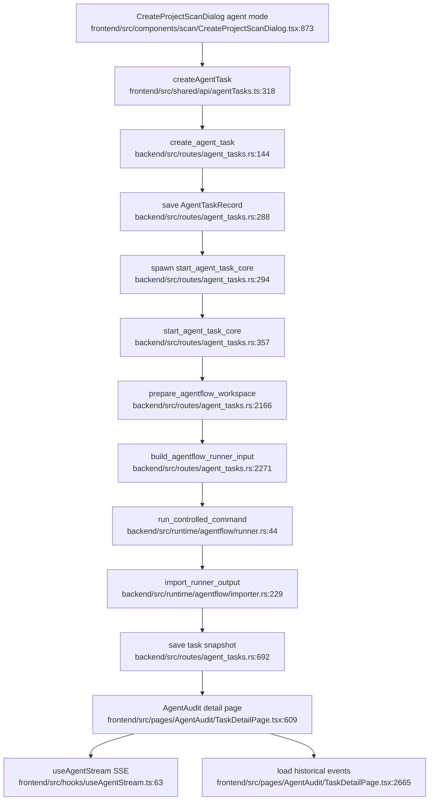

# Intelligent Audit / AgentFlow Flowchart

## Sources consulted

- `backend/src/routes/agent_tasks.rs:43-72` — AgentTask route map.
- `backend/src/routes/agent_tasks.rs:144-303` — create AgentTask, save snapshot, spawn start.
- `backend/src/routes/agent_tasks.rs:357-692` — start core, workspace prep, runner execution, import, save.
- `backend/src/routes/agent_tasks.rs:2163-2365` — workspace and runner input helpers.
- `backend/src/runtime/agentflow/runner.rs:44-111` — controlled command execution.
- `backend/src/runtime/agentflow/importer.rs:229-390` — canonical/legacy runner output import.
- `frontend/src/shared/api/agentTasks.ts:254-356`, `frontend/src/shared/api/agentTasks.ts:452-526` — task creation and event streaming APIs.
- `frontend/src/pages/AgentAudit/TaskDetailPage.tsx:609-760`, `frontend/src/pages/AgentAudit/TaskDetailPage.tsx:1289-1420`, `frontend/src/pages/AgentAudit/TaskDetailPage.tsx:2665-2920` — detail page loading and stream backfill.
- `frontend/src/hooks/useAgentStream.ts:63-180` — SSE stream hook.

## Concrete findings

- `create_agent_task` rejects forbidden static-input payloads, creates an `AgentTaskRecord`, saves it, then spawns `start_agent_task_core`.
- `start_agent_task_core` prepares workspace from the project archive, builds runner input, executes controlled AgentFlow command, reads output JSON, imports events/findings/checkpoints, and saves the updated task snapshot.
- Frontend detail page loads task/findings/tree/events, backfills historical events, then connects to SSE via `useAgentStream`.

## Side effects

- Task snapshot writes.
- Archive extraction and workspace file I/O.
- Docker/process execution via AgentFlow runner command.
- Agent report/finding export downloads.
- SSE connections from browser.

## External dependencies

- Project workspace archives.
- LLM config/preflight before creation.
- Docker AgentFlow runner image/tooling.
- Task management/dashboard aggregators.

## Confidence / gaps

- **Confidence**: Medium-high.
- **Gaps**: Did not inspect Python `backend/agentflow/pipelines/intelligent_audit.py` in depth; runner internals are summarized from Rust command/input/import boundaries.
