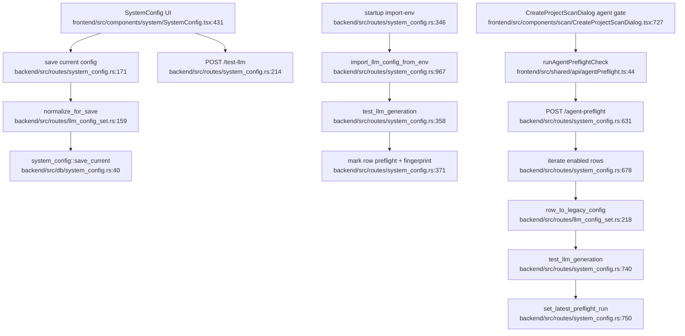

# LLM Config Set and Agent Preflight Flowchart

## Sources consulted

- `backend/src/routes/system_config.rs:138-149` — system-config route map.
- `backend/src/routes/system_config.rs:171-192` — save current config and normalize for save.
- `backend/src/routes/system_config.rs:214-235` — settings-page LLM test start.
- `backend/src/routes/system_config.rs:346-427` — `.argus-intelligent-audit.env` import and real-test fingerprint save.
- `backend/src/routes/system_config.rs:429-455` — model fetch start.
- `backend/src/routes/system_config.rs:631-750` — agent preflight loop over enabled rows.
- `backend/src/routes/llm_config_set.rs:150-235` — normalize/public/selected runtime/legacy conversion.
- `backend/src/db/system_config.rs:10-84` — singleton config persistence.
- `frontend/src/components/system/SystemConfig.tsx:273-360`, `frontend/src/components/system/SystemConfig.tsx:431-620` — frontend config state and save/test controls.
- `frontend/src/shared/api/agentPreflight.ts:44-71` — frontend agent preflight wrapper.
- `frontend/src/components/scan/create-project-scan/llmGate.ts:1-180` — dialog LLM gate view-state helpers.

## Concrete findings

- `put_current` normalizes schema-v2 LLM rows, preserves secrets, merges other config, saves singleton config, then syncs a legacy mirror.
- `import_env` requires token, reads `.argus-intelligent-audit.env`, runs a real LLM test, marks row preflight/fingerprint on success, and persists metadata.
- `agent_preflight` differs from settings test: it iterates enabled rows, validates missing fields, builds runtime config, runs live test, marks row preflight, stores latest winning row/fingerprint, and later checks runner readiness.
- Frontend create-dialog calls `runAgentPreflightCheck`, not raw `/test-llm`, for intelligent-audit gating.

## Side effects

- Singleton system config writes.
- LLM test HTTP calls to provider endpoints.
- Metadata/fingerprint persistence.
- Legacy Python config mirror sync.

## External dependencies

- LLM provider catalog and tester.
- Create scan dialog and AgentFlow runner readiness.
- Startup scripts that call import-env.

## Confidence / gaps

- **Confidence**: High for config/preflight control flow.
- **Gaps**: Did not inspect every LLM provider implementation and all fallback category branches.
