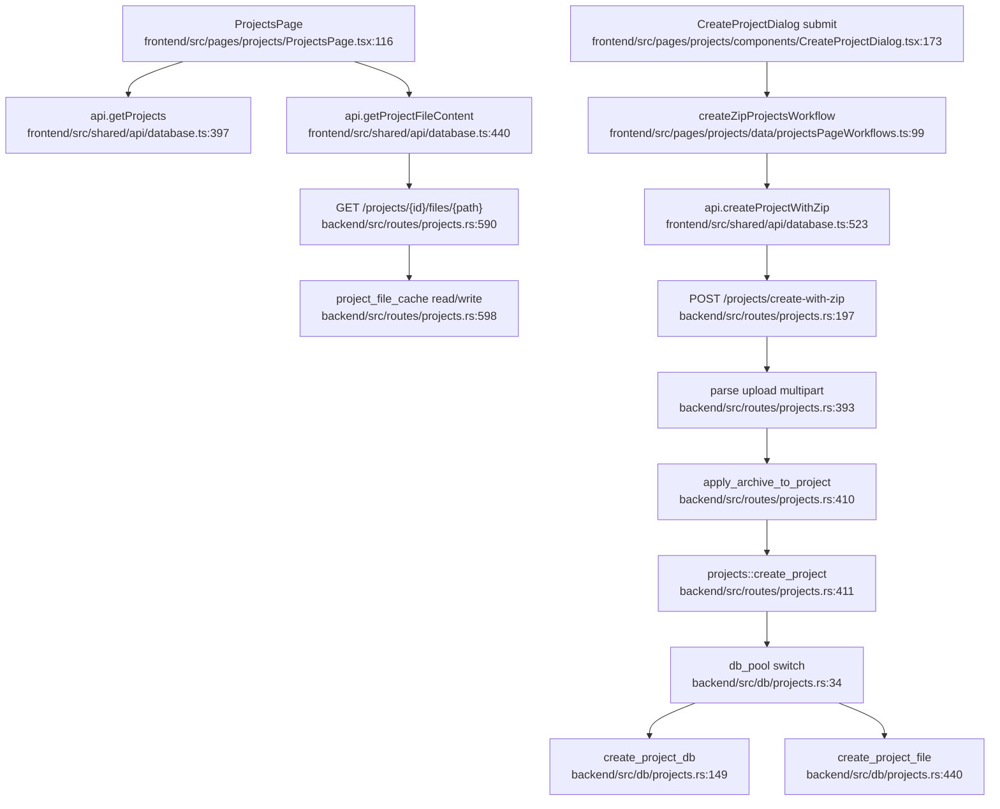

# Project Workspace and Archive Management Flowchart

## Sources consulted

- `backend/src/routes/projects.rs:194-235` — project API routes.
- `backend/src/routes/projects.rs:237-260` — create project handler constructs `StoredProject`.
- `backend/src/routes/projects.rs:389-415` — create project with ZIP and persist archive.
- `backend/src/routes/projects.rs:432-455` — upload ZIP to existing project.
- `backend/src/routes/projects.rs:558-620` — file listing/tree/content and cache path.
- `backend/src/db/projects.rs:34-72` — DB/file storage dispatch.
- `backend/src/db/projects.rs:149-182` — SQL insert and archive upsert.
- `frontend/src/pages/projects/ProjectsPage.tsx:116-230` — project list/search/page state.
- `frontend/src/pages/projects/components/CreateProjectDialog.tsx:173-204` — ZIP batch create submission.
- `frontend/src/shared/api/database.ts:397-460`, `frontend/src/shared/api/database.ts:473-551` — frontend project API methods.

## Concrete findings

- Frontend project browser gets projects through `api.getProjects(...)` and local filtering/pagination.
- ZIP creation path calls `createProjectWithZip`, which maps to backend `/projects/create-with-zip`.
- Backend persists metadata through `db::projects`, with PostgreSQL when `state.db_pool` is present and JSON file fallback otherwise.
- File browsing reads project archive and optionally caches file content in `state.project_file_cache`.

## Side effects

- DB writes to `rust_projects` and project archive rows.
- File writes for archive storage and JSON fallback.
- File content cache mutation in memory.
- Legacy mirror sync via `sync_python_project_mirror(...)` after create/upload.

## External dependencies

- `backend/src/archive.rs` for archive parsing/listing/content.
- `backend/src/db/task_state.rs` for project deletion cleanup.
- Static/intelligent tasks consume project IDs and archives.

## Confidence / gaps

- **Confidence**: High for happy path.
- **Gaps**: Did not trace project import/export bundle internals or all mirror sync details.
