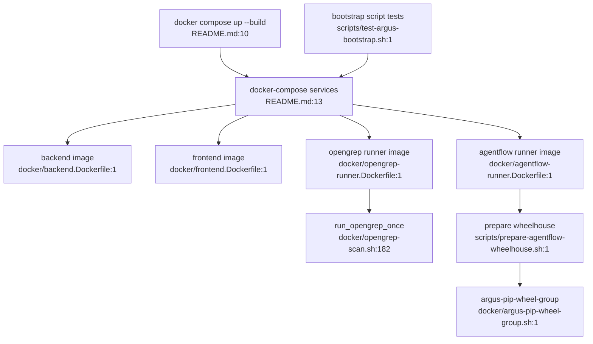

# Runner Images and Build/Release Tooling Flowchart

## Sources consulted

- `README.md:7-30` — Docker Compose startup and `.argus-intelligent-audit.env` notes.
- `docs/architecture.md:32-55` — Opengrep and AgentFlow runner entry points.
- `docker/opengrep-scan.sh:182-316` — Opengrep runner execution/recovery/summary.
- `docker/argus-pip-wheel-group.sh:1` — wheel group helper entry.
- `scripts/prepare-agentflow-wheelhouse.sh:1` — local wheelhouse prep script entry.
- `docker/agentflow-runner.Dockerfile:1` — AgentFlow runner image definition entry.
- `scripts/test-argus-bootstrap.sh:1` — bootstrap script contract test entry.

## Concrete findings

- Compose is the documented startup path.
- Opengrep runner is a shell script with JSON recovery and batch helpers.
- AgentFlow runner build has separate wheelhouse preparation and Docker image build surfaces.
- Build/release tooling is operational support, not application domain logic.

## Side effects

- Docker builds/images/containers.
- Wheelhouse file generation.
- Runner workspace/result file I/O.
- Potential Docker prune only in aggressive reset mode (per remembered contract; not re-traced here).

## External dependencies

- Docker daemon and Compose.
- Python/pip mirrors for AgentFlow wheelhouse when cache misses.
- Backend task execution invokes runner images.

## Confidence / gaps

- **Confidence**: Medium.
- **Gaps**: Did not print Dockerfile line ranges because this phase focused on source feature flows; verify before implementing build changes.
