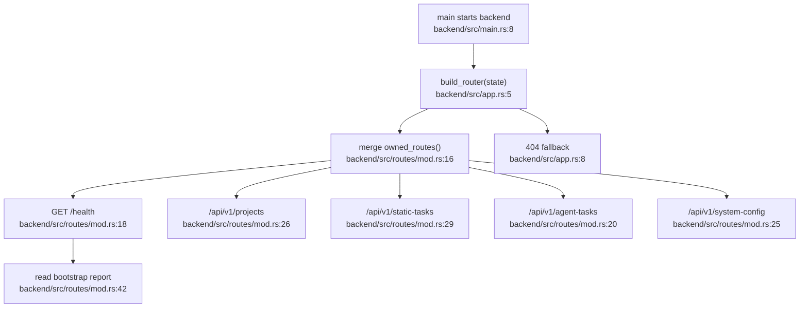

# Rust Gateway Shell Flowchart

## Sources consulted

- `backend/src/main.rs:8` — backend process entry.
- `backend/src/app.rs:5-14` — builds Axum router and fallback.
- `backend/src/routes/mod.rs:16-30` — owns API route nesting.
- `backend/src/routes/mod.rs:32-49` — health handler reads bootstrap status.

## Concrete findings

- `build_router(state)` merges `routes::owned_routes()` and attaches `AppState`.
- `owned_routes()` maps `/api/v1/projects`, `/api/v1/static-tasks`, `/api/v1/agent-tasks`, `/api/v1/system-config`, `/api/v1/search`, `/api/v1/skills`, and `/api/v1/agent-test`.
- Unknown routes return `404 route not owned by rust gateway`.

## Side effects

- Router construction has no domain side effects.
- Health handler reads `state.bootstrap` only.

## External dependencies

- All domain route modules.

## Confidence / gaps

- **Confidence**: High.
- **Gaps**: Did not inspect server binding in full `main.rs` beyond entry point.
