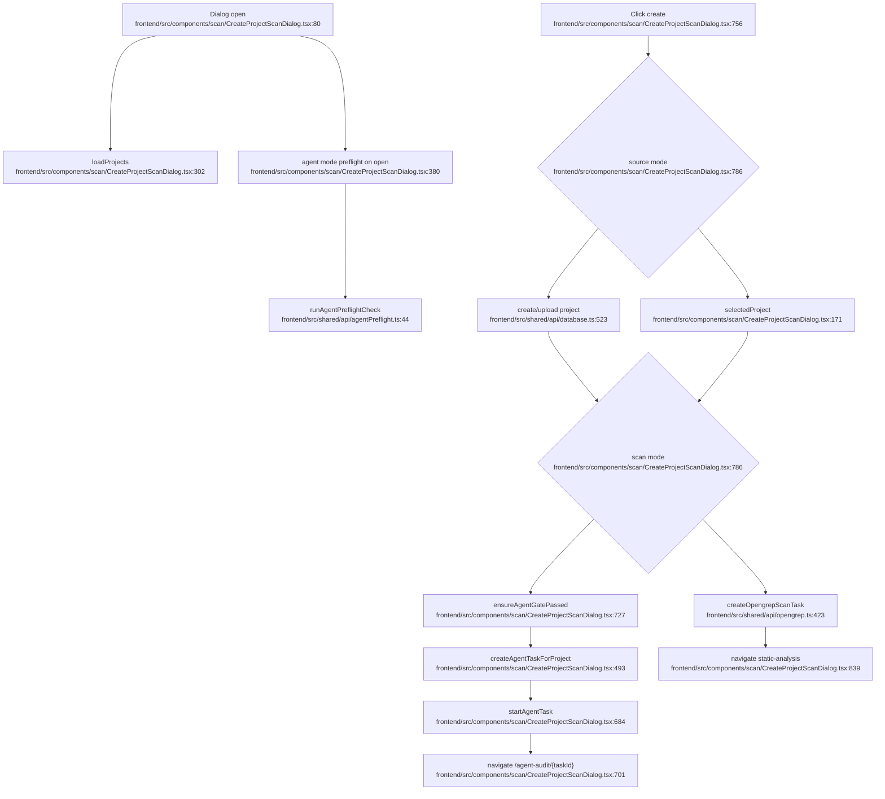

# Scan Creation Dialog and Task Launch UX Flowchart

## Sources consulted

- `frontend/src/components/scan/CreateProjectScanDialog.tsx:80-230` — dialog props/state and project filtering.
- `frontend/src/components/scan/CreateProjectScanDialog.tsx:302-328` — project loading.
- `frontend/src/components/scan/CreateProjectScanDialog.tsx:380-407` — open-time preflight for agent mode.
- `frontend/src/components/scan/CreateProjectScanDialog.tsx:451-493` — static task and agent payload helpers.
- `frontend/src/components/scan/CreateProjectScanDialog.tsx:632-662` — manual quick-fix/preflight test.
- `frontend/src/components/scan/CreateProjectScanDialog.tsx:678-727` — agent task creation/start/navigation and gate check.
- `frontend/src/components/scan/CreateProjectScanDialog.tsx:756-889` — primary create handler for upload/existing project and static/agent branches.
- `frontend/src/shared/api/opengrep.ts:423` — create Opengrep task API.
- `frontend/src/shared/api/agentTasks.ts:318` — create AgentTask API.
- `frontend/src/shared/api/agentPreflight.ts:44` — preflight API wrapper.

## Concrete findings

- Dialog can create a task for an existing project or upload a new project when allowed.
- Static branch calls `createOpengrepScanTask` and navigates to static analysis.
- Agent branch calls `ensureAgentGatePassed` immediately before creation, then `createAgentTask` and `startAgentTask`, and navigates to `/agent-audit/{taskId}`.
- Upload success is tracked separately from agent-task failure so the uploaded project can be retained.

## Side effects

- Project creation/upload API calls when source mode is upload.
- Static or intelligent task creation.
- Agent preflight LLM/provider calls indirectly.
- Navigation and toast state.

## External dependencies

- Project Workspace APIs.
- Static Audit Opengrep APIs.
- LLM Config Preflight.
- Intelligent Audit AgentTask APIs.

## Confidence / gaps

- **Confidence**: High for main UI orchestration.
- **Gaps**: Did not inspect all child rendering in `Content.tsx`.
