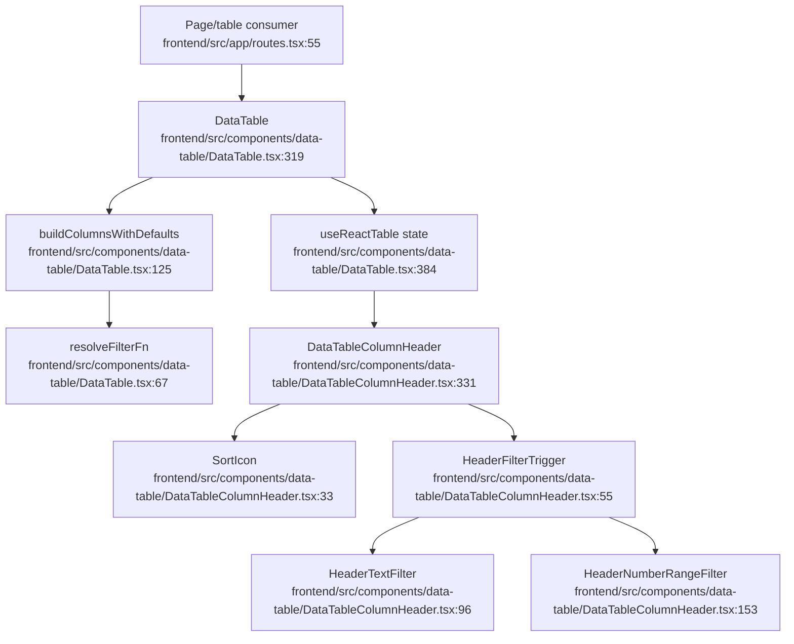

# Shared DataTable and Common Frontend Platform Flowchart

## Sources consulted

- `frontend/src/components/data-table/DataTable.tsx:67-123` — column defaults and filter function resolution.
- `frontend/src/components/data-table/DataTable.tsx:319-470` — `DataTable` state/table construction.
- `frontend/src/components/data-table/DataTableColumnHeader.tsx:33-96` — sort/filter trigger helpers.
- `frontend/src/components/data-table/DataTableColumnHeader.tsx:96-235` — text/number filter popovers.
- `frontend/src/app/routes.tsx:55-170` — route-level consumers.
- `docs/glossary.md:80-95` — Shared DataTable and task activities table maintenance notes.

## Concrete findings

- `DataTable` wraps TanStack table state for local/manual modes, sorting, filtering, pagination, visibility, sizing, row selection, summary, toolbar, loading, and empty states.
- `buildColumnWithDefaults` auto-adds multi-select filters to accessor columns unless disabled/plain.
- `DataTableColumnHeader` centralizes sort icon, filter active detection, and filter popover/dropdown triggers.

## Side effects

- React state/URL state updates through callbacks.
- No backend side effects directly.

## External dependencies

- TanStack React Table.
- UI primitives and page-specific columns/view models.

## Confidence / gaps

- **Confidence**: High for table core.
- **Gaps**: Did not inspect every toolbar/pagination/URL-state file.
