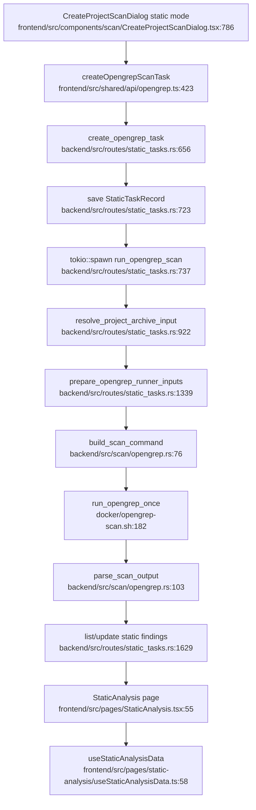

# Static Audit / Opengrep Flowchart

## Sources consulted

- `backend/src/routes/static_tasks.rs:35-91` — Opengrep rules/task/finding route map.
- `backend/src/routes/static_tasks.rs:656-741` — static task creation and background spawn.
- `backend/src/routes/static_tasks.rs:922-949` — project archive resolution.
- `backend/src/routes/static_tasks.rs:951-1045` — `run_opengrep_scan` / inner runner flow beginning.
- `backend/src/routes/static_tasks.rs:1287-1365` — runner spec/input preparation region.
- `backend/src/scan/opengrep.rs:18-120` — rule assets, command build, output parse entry points.
- `frontend/src/shared/api/opengrep.ts:81-124`, `frontend/src/shared/api/opengrep.ts:423-515` — frontend Opengrep API calls.
- `frontend/src/pages/StaticAnalysis.tsx:55-240` — static analysis page state, AI helper, rows/header.
- `frontend/src/pages/static-analysis/useStaticAnalysisData.ts:18-114` — static task/finding fetching.
- `frontend/src/pages/static-analysis/viewModel.ts:80-180`, `frontend/src/pages/static-analysis/viewModel.ts:590-696` — project-name fallback and list/header view model.
- `docker/opengrep-scan.sh:182-316` — runner shell execution/recovery helpers.

## Concrete findings

- `create_opengrep_task` creates a `StaticTaskRecord`, saves it into task snapshot, then spawns `run_opengrep_scan`.
- `run_opengrep_scan_inner` resolves the project archive, materializes runner inputs, runs Docker/runner spec, parses JSON results, and updates task progress/findings.
- Frontend static detail page loads task + batched findings via `useStaticAnalysisData` and renders unified finding rows from the Opengrep task ID.
- Static AI helper calls three separate backend endpoints from the page (`ai-analyze-code`, `ai-evaluate-rules`, `ai-suggest-fixes`).

## Side effects

- Task snapshot writes in `backend/src/db/task_state.rs`.
- Docker runner/process execution.
- Temporary workspace and result-file I/O.
- Static finding status updates.

## External dependencies

- Project archives from Project Workspace.
- Task management/dashboard read static task records.
- System config is read for some AI/rule helper flows.

## Confidence / gaps

- **Confidence**: Medium-high.
- **Gaps**: The full `run_opengrep_scan_inner` body is large; diagram emphasizes primary happy path and omits most error/recovery branches.
