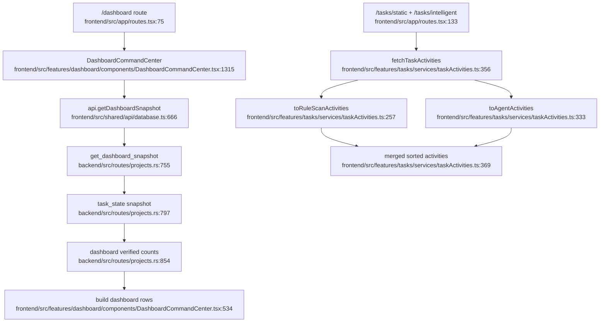

# Task Management and Dashboard Aggregation Flowchart

## Sources consulted

- `backend/src/routes/projects.rs:755-854` — dashboard snapshot route and summary building start.
- `backend/src/routes/projects.rs:854-1090` — dashboard verified counts/status/recent-task helpers.
- `frontend/src/features/tasks/services/taskActivities.ts:257-377` — convert Opengrep and AgentTask records into unified activity rows.
- `frontend/src/shared/api/database.ts:666-672` — frontend dashboard snapshot API method.
- `frontend/src/features/dashboard/components/DashboardCommandCenter.tsx:333-560` — verified total, trend rows, risk rows, task tooltip items.
- `frontend/src/app/routes.tsx:75-152` — dashboard and task-management routes.

## Concrete findings

- Dashboard data is served from `/projects/dashboard-snapshot` and built from project names plus task snapshot records.
- Static task rows and intelligent task rows are normalized separately, then merged/sorted in `fetchTaskActivities`.
- Dashboard chart rows compute project/language/vulnerability-type/LOC views in the frontend from backend snapshot payloads.

## Side effects

- Mostly read-only aggregation.
- Cancel actions route back to static/agent task APIs from task management rows.

## External dependencies

- Project Workspace for names and dashboard endpoints.
- Static and Agent task records.
- Shared DataTable for rendering task lists.

## Confidence / gaps

- **Confidence**: Medium.
- **Gaps**: Did not inspect `Dashboard.tsx` and task page components in full.
