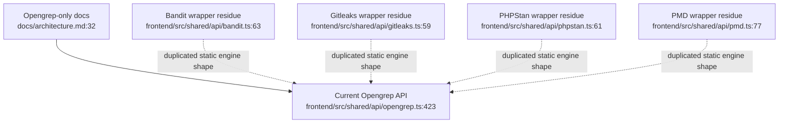
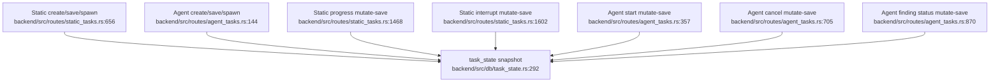
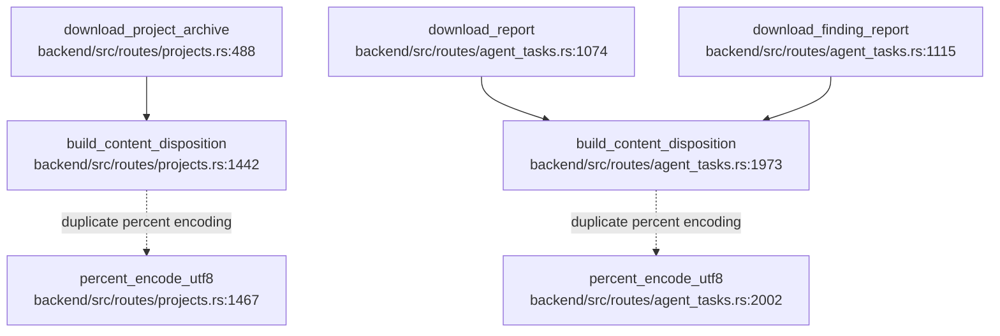
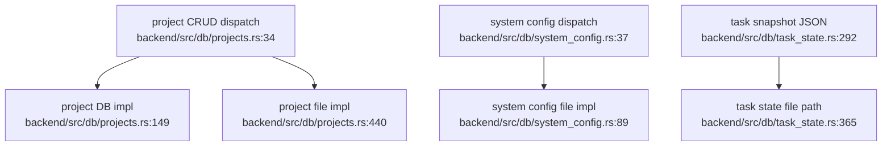
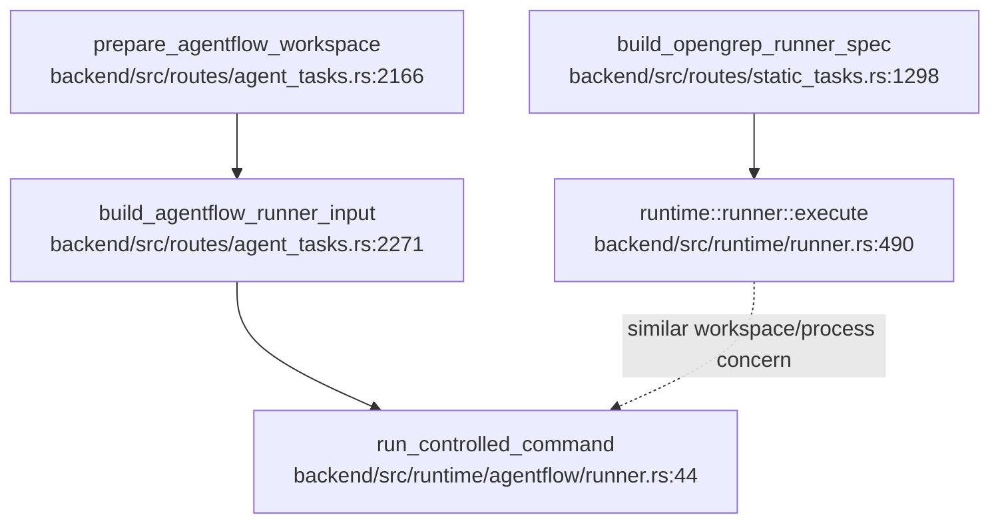
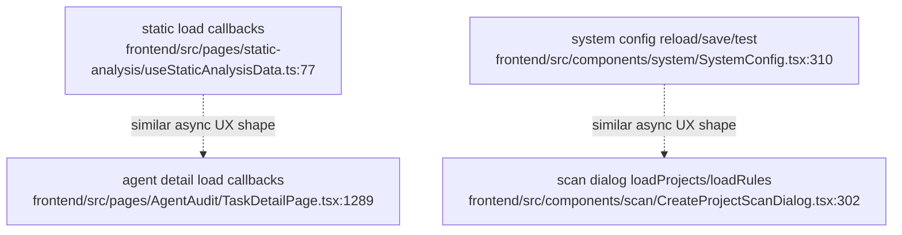

# PATHFINDER Duplication Report

## Subagent status

The mandated within-feature and cross-feature duplication subagents were both launched, but both failed with upstream `502 Bad Gateway`. This report is therefore orchestrator-produced from local read-only grep/source inspection plus the Phase 1 flowcharts.

## Sources consulted

- `PATHFINDER-2026-04-30/01-flowcharts/*.md` — current feature flowcharts.
- `backend/src/db/projects.rs:34-72`, `backend/src/db/projects.rs:123-145`, `backend/src/db/projects.rs:149-190`, `backend/src/db/projects.rs:440-512` — project DB/file dispatch and duplicate storage implementations.
- `backend/src/db/system_config.rs:37-84`, `backend/src/db/system_config.rs:89-127` — system-config file fallback storage.
- `backend/src/db/task_state.rs:292-365` — task-state JSON snapshot storage.
- `backend/src/routes/projects.rs:1442-1479`, `backend/src/routes/agent_tasks.rs:1917-2013` — duplicate content-disposition / percent-encoding helpers.
- `backend/src/routes/static_tasks.rs:656-741`, `backend/src/routes/static_tasks.rs:1468-1527`, `backend/src/routes/static_tasks.rs:1602-1627` — static task lifecycle mutation.
- `backend/src/routes/agent_tasks.rs:144-303`, `backend/src/routes/agent_tasks.rs:357-408`, `backend/src/routes/agent_tasks.rs:705-731`, `backend/src/routes/agent_tasks.rs:870-928` — agent task lifecycle mutation.
- `frontend/src/shared/api/bandit.ts:63-143`, `frontend/src/shared/api/gitleaks.ts:59-142`, `frontend/src/shared/api/phpstan.ts:61-147`, `frontend/src/shared/api/pmd.ts:77-152`, `frontend/src/shared/api/opengrep.ts:423-515` — parallel static engine API wrappers, including retired engines.
- `frontend/src/components/scan/CreateProjectScanDialog.tsx:302-328`, `frontend/src/components/scan/hooks/useTaskForm.ts:10-19`, `frontend/src/components/scan/CreateScanTaskDialog.tsx:158-176` — repeated project/rule loading patterns.
- `backend/src/runtime/runner.rs:490-757`, `backend/src/runtime/agentflow/runner.rs:44-111`, `backend/src/routes/static_tasks.rs:1287-1365`, `backend/src/routes/agent_tasks.rs:2163-2365` — runner/workspace command scaffolding.

## D1 — Parallel static-engine frontend API wrappers (accidental residue; consolidate by deletion/retirement boundary)

### Evidence

- `frontend/src/shared/api/opengrep.ts:423-515` defines current Opengrep task create/get/interrupt/findings/list wrappers for `/static-tasks/tasks` and `/static-tasks/findings`.
- `frontend/src/shared/api/bandit.ts:63-143` defines analogous create/get/interrupt/findings/status/rules wrappers for `/static-tasks/bandit/...`.
- `frontend/src/shared/api/gitleaks.ts:59-142` defines analogous create/get/interrupt/findings/status/rules wrappers for `/static-tasks/gitleaks/...`.
- `frontend/src/shared/api/phpstan.ts:61-147` defines analogous create/get/interrupt/findings/status/rules wrappers for `/static-tasks/phpstan/...`.
- `frontend/src/shared/api/pmd.ts:77-152` defines analogous create/get/interrupt/findings/status/presets wrappers for `/static-tasks/pmd/...`.
- `docs/architecture.md:32-41` says the current runnable static audit mainline is Opengrep-only and retired engines should not be treated as current entry points.

### Why they diverged

These wrappers likely predate the Rust gateway’s Opengrep-only mainline and remain as migration/compatibility residue. Their shape mirrors the current Opengrep wrapper but points at routes that current docs say are retired.

### Mermaid

### Classification

- **Accidental/residual duplication**.
- **Recommendation**: Do not abstract these into a static-engine factory. Prefer deleting or quarantine-marking retired wrappers after confirming no current imports/tests require them.

## D2 — Task lifecycle mutation is duplicated across static and intelligent routes (partly legitimate, helper-worthy)

### Evidence

- Static create saves a `StaticTaskRecord` and spawns a runner: `backend/src/routes/static_tasks.rs:656-741`.
- Agent create saves an `AgentTaskRecord` and spawns `start_agent_task_core`: `backend/src/routes/agent_tasks.rs:144-303`.
- Static progress/failure/interrupt updates load snapshot, mutate record, save snapshot: `backend/src/routes/static_tasks.rs:1468-1527`, `backend/src/routes/static_tasks.rs:1602-1627`.
- Agent start/cancel/finding-status updates load snapshot, mutate record, save snapshot: `backend/src/routes/agent_tasks.rs:357-408`, `backend/src/routes/agent_tasks.rs:705-731`, `backend/src/routes/agent_tasks.rs:870-928`.
- Shared snapshot primitives already exist: `backend/src/db/task_state.rs:292-365`.

### Why they diverged

Static and intelligent tasks have different record schemas and terminal semantics, so a single task object abstraction would be too broad. But the repeated load-mutate-save-with-record lookup pattern is accidental boilerplate.

### Mermaid

### Classification

- **Legitimate specialization at domain record level; accidental duplication at snapshot mutation helper level**.
- **Recommendation**: Consolidate only the narrow snapshot record mutation helper(s), not the static/agent task domain models.

## D3 — Content-Disposition / UTF-8 percent encoding duplicated in two route modules (accidental; consolidate)

### Evidence

- Project archive downloads build content disposition and percent encode filenames in `backend/src/routes/projects.rs:1442-1479`.
- Agent report downloads independently sanitize filename segments, build content disposition, and percent encode in `backend/src/routes/agent_tasks.rs:1917-2013`.
- Both implementations produce `attachment; filename="..."; filename*=UTF-8''...` and both hand-roll percent encoding.

### Why they diverged

Archive download and report export were implemented in separate route modules. The report path has extra domain-specific filename construction, but the HTTP header encoding concern is shared.

### Mermaid

### Classification

- **Accidental duplication**.
- **Recommendation**: Move shared attachment header encoding to one backend utility while keeping report-specific filename naming in `agent_tasks.rs`.

## D4 — DB/file fallback persistence patterns repeat across project/system/task state (mostly legitimate; avoid broad repository abstraction)

### Evidence

- Projects dispatch every CRUD method on `state.db_pool.is_some()`: `backend/src/db/projects.rs:34-72`, archive methods at `backend/src/db/projects.rs:123-145`, DB implementation at `backend/src/db/projects.rs:149-190`, file implementation at `backend/src/db/projects.rs:440-512`.
- System config uses DB when available then file fallback helpers: `backend/src/db/system_config.rs:37-84`, `backend/src/db/system_config.rs:89-127`.
- Task state is JSON snapshot only via load/save helpers: `backend/src/db/task_state.rs:292-365`.

### Why they diverged

The data shapes differ: projects are relational rows plus archives, system config is singleton JSON, task state is snapshot JSON. A generic repository trait would likely add abstraction without reducing real complexity.

### Mermaid

### Classification

- **Mostly legitimate specialization**.
- **Recommendation**: Do not introduce a broad storage trait/factory. A tiny helper for “db_pool present” would not pay for itself. Revisit only if task_state gains DB persistence.

## D5 — Runner/workspace scaffolding exists in both generic Docker runner and AgentFlow-specific runner (legitimate specialization with one possible boundary cleanup)

### Evidence

- Generic scanner Docker runner handles workspace mounts, docker create/start/wait/log capture, and summary gates in `backend/src/runtime/runner.rs:490-757`.
- Static tasks build `RunnerSpec` and Opengrep-specific paths in `backend/src/routes/static_tasks.rs:1287-1365`.
- Agent tasks prepare AgentFlow workspace/input in `backend/src/routes/agent_tasks.rs:2163-2365`.
- AgentFlow command execution uses a separate controlled process runner in `backend/src/runtime/agentflow/runner.rs:44-111`.

### Why they diverged

Static scanning uses a generic Docker runner abstraction. AgentFlow currently has a more specific runtime contract and output importer. Trust model and output contract differ enough that forced unification could be risky.

### Mermaid

### Classification

- **Legitimate specialization** today.
- **Recommendation**: Do not unify runner execution broadly. If cleanup is needed, extract only path-safe workspace helpers after tests prove identical semantics.

## D6 — Frontend load/error/toast patterns are repeated across pages (low-value duplication; defer)

### Evidence

- Static analysis data uses repeated `useCallback` load + toast error flows: `frontend/src/pages/static-analysis/useStaticAnalysisData.ts:77-114`, `frontend/src/pages/static-analysis/useStaticAnalysisData.ts:160-202`.
- AgentAudit loads task/findings/tree/events with local loading/error handling: `frontend/src/pages/AgentAudit/TaskDetailPage.tsx:1289-1420`, `frontend/src/pages/AgentAudit/TaskDetailPage.tsx:2665-2928`.
- SystemConfig reload/save/test uses local loading/toast patterns: `frontend/src/components/system/SystemConfig.tsx:310-321`, `frontend/src/components/system/SystemConfig.tsx:495-535`.
- Scan dialog repeats project/rule loading and toast failures: `frontend/src/components/scan/CreateProjectScanDialog.tsx:302-328`.

### Why they diverged

These are page-local async UX states with different error copy and refresh semantics.

### Mermaid

### Classification

- **Low-value duplication**.
- **Recommendation**: Defer. Do not add a generic async hook unless a concrete page rewrite needs it; copy-specific UX is legitimate.

## Summary table

| ID | Concern | Classification | Proposed action |
| --- | --- | --- | --- |
| D1 | Retired static-engine frontend wrappers | Accidental/residual | Delete/quarantine, no factory |
| D2 | Task snapshot mutation boilerplate | Mixed | Narrow helper only |
| D3 | Content-Disposition/percent encoding | Accidental | Shared backend utility |
| D4 | DB/file fallback persistence | Mostly legitimate | Leave as-is |
| D5 | Runner/workspace scaffolding | Legitimate specialization | Leave broad runners separate |
| D6 | Frontend async load/toast patterns | Low-value | Defer |

## Confidence and known gaps

- **Confidence**: Medium. Duplication claims D1-D3 are strongly evidenced by multiple cited source locations. D4-D6 are more judgment-heavy.
- **Known gaps**: Subagent reports were unavailable due upstream 502s. Import graph was approximated with `rg`, not a full AST/dependency graph.
