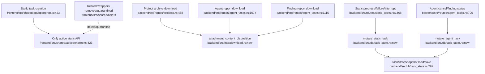

# PATHFINDER Unified Proposal

## Proposal principles

- Prefer deletion over abstraction.
- Preserve legitimate static/intelligent task specialization.
- Do not introduce registries/factories for retired scan engines.
- Consolidate only concerns with clear duplicate behavior and narrow blast radius.

## Unified System A — Retired Static Engine API Quarantine

### Problem

The frontend still contains parallel retired static-engine API wrappers that mirror Opengrep-era static task shapes even though current docs define Opengrep-only static auditing.

### Simplest unified design

- **Consolidated component**: `frontend/src/shared/api/opengrep.ts` remains the only active static audit API entry point.
- **Single entry point**: `createOpengrepScanTask(...)` at `frontend/src/shared/api/opengrep.ts:423` for static task creation.
- **Old call sites become**:
  - retired static-engine API wrappers → removed or explicitly moved to a retired compatibility folder if tests require them.
- **Loss of capability**: Removes active-looking wrappers for retired engines. Acceptable if no current route/page imports them; if tests import them solely for legacy compatibility, quarantine with clear naming instead of exposing them as active APIs.

### Anti-patterns rejected

- Do not build a `staticEngineApiFactory` around retired engines.
- Do not add feature flags to preserve unsupported routes.
- Do not reintroduce multi-engine UI semantics.

## Unified System B — Backend Attachment Header Utility

### Problem

Project archive downloads and AgentTask report downloads both hand-roll `Content-Disposition` attachment headers and UTF-8 percent encoding.

### Simplest unified design

- **Consolidated component**: `backend/src/http/download.rs` or `backend/src/routes/download.rs` (small module; no dependency cycle).
- **Single entry point**: `attachment_content_disposition(filename: &str, ascii_fallback: &str) -> String`.
- **Old call sites become**:
  - `backend/src/routes/projects.rs:1442` `build_content_disposition(original_filename)` → call shared `attachment_content_disposition(original_filename, "download.zip")`.
  - `backend/src/routes/agent_tasks.rs:1973` `build_content_disposition(filename)` → call shared `attachment_content_disposition(filename, "vulnerability-report")` after report-specific filename construction.
  - `backend/src/routes/projects.rs:1467` and `backend/src/routes/agent_tasks.rs:2002` `percent_encode_utf8` → deleted in favor of shared helper.
- **Loss of capability**: None intended. Report-specific `build_report_download_filename(...)` remains local to AgentTask.

### Anti-patterns rejected

- Do not move report-specific Chinese filename construction into generic HTTP utility.
- Do not change public downloaded filename format unless tests force it.

## Unified System C — Narrow Task Snapshot Mutation Helper

### Problem

Static and AgentTask routes repeatedly load the task snapshot, find a record, mutate it, and save. Domain records differ, but the load-mutate-save boilerplate is repeated.

### Simplest unified design

- **Consolidated component**: `backend/src/db/task_state.rs`.
- **Single entry points**:
  - `mutate_static_task(state, task_id, |record| -> Result<T>)`
  - `mutate_agent_task(state, task_id, |record| -> Result<T>)`
- **Old call sites become**:
  - `backend/src/routes/static_tasks.rs:1468` `update_scan_progress` → use `mutate_static_task`.
  - `backend/src/routes/static_tasks.rs:1499` `update_scan_task_failed` → use `mutate_static_task`.
  - `backend/src/routes/static_tasks.rs:1602` `interrupt_static_task` → use `mutate_static_task`.
  - `backend/src/routes/agent_tasks.rs:705` `cancel_agent_task` → use `mutate_agent_task`.
  - `backend/src/routes/agent_tasks.rs:870` / `backend/src/routes/agent_tasks.rs:906` finding status updates → likely still need full snapshot because they also refresh aggregates, but can use helper if closure gets mutable record.
- **Loss of capability**: None if closure can return custom response data and helper preserves existing lock/save semantics.

### Anti-patterns rejected

- Do not create a generic `Task` trait that erases static vs intelligent semantics.
- Do not merge static and AgentTask status models.
- Do not change task-state file format.

## Concerns intentionally not unified

### DB/file fallback persistence

`backend/src/db/projects.rs`, `backend/src/db/system_config.rs`, and `backend/src/db/task_state.rs` have different data shapes and persistence guarantees. A broad repository abstraction would add flexibility without simplifying current code.

### Runner execution

`backend/src/runtime/runner.rs` and `backend/src/runtime/agentflow/runner.rs` share process/workspace concerns but represent different runner contracts. Forced unification risks breaking AgentFlow import semantics or Opengrep summary-gate behavior.

### Page-local frontend async UX

Repeated `load/catch/toast` patterns are not worth a generic hook without a concrete page-level simplification task.

## Combined proposed flowchart

## Confidence and risk

- **Highest-confidence unification**: Backend attachment header utility.
- **Highest deletion value**: Retired frontend static engine wrappers, but only after import/test search.
- **Highest behavior-risk**: Task snapshot mutation helper; should be planned with regression tests first.
